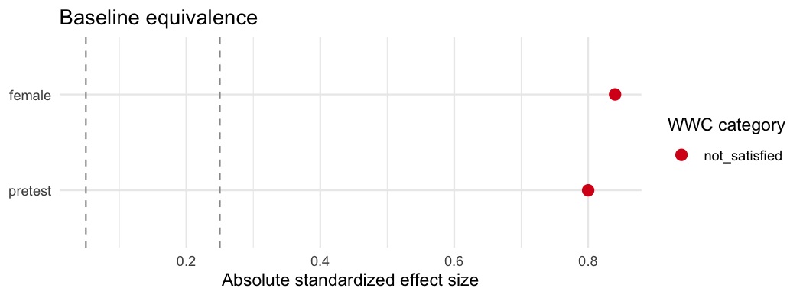

<!-- README.md is generated from README.Rmd. Please edit that file, then run devtools::build_readme(). -->

# baselinr

<!-- badges: start -->

[](https://CRAN.R-project.org/package=baselinr)
[](https://CRAN.R-project.org/package=baselinr)
[](https://github.com/zl1212-ship-it/baselinr/actions/workflows/R-CMD-check.yaml)
[](https://lifecycle.r-lib.org/articles/stages.html#experimental)
[](https://doi.org/10.5281/zenodo.20937887)
<!-- badges: end -->

`baselinr` builds report-ready **baseline equivalence** tables for
impact evaluations in education research, following the conventions of
the [What Works Clearinghouse (WWC)](https://ies.ed.gov/ncee/wwc/).
Given a treatment indicator and a set of covariates, it reports the
appropriate standardized effect size for each covariate, **Hedges’ g**
for continuous covariates and the **Cox index** for binary ones, together
with the WWC equivalence category.

It is a thin, education-specific reporting layer. For general-purpose
covariate balance assessment, see
[`cobalt`](https://ngreifer.github.io/cobalt/); `baselinr` focuses
narrowly on the WWC equivalence categories that education evaluation
reports are required to state.

## Installation

Install the released version from CRAN:

``` r
install.packages("baselinr")
```

Or the development version from GitHub:

``` r
# install.packages("remotes")
remotes::install_github("zl1212-ship-it/baselinr")
```

## Example

``` r
library(baselinr)

study <- data.frame(
  treat   = c(1, 1, 1, 0, 0, 0),
  pretest = c(5, 6, 7, 4, 5, 6), # continuous -> Hedges' g
  female  = c(1, 0, 1, 0, 0, 1)  # binary     -> Cox index
)

knitr::kable(baseline_equivalence(study, treatment = "treat"), digits = 3)
```

| covariate | type | n_treatment | n_comparison | mean_treatment | mean_comparison | sd_treatment | sd_comparison | effect_size | wwc_category |
|:---|:---|---:|---:|---:|---:|---:|---:|---:|:---|
| pretest | continuous | 3 | 3 | 6.000 | 5.000 | 1.000 | 1.000 | 0.80 | not_satisfied |
| female | binary | 3 | 3 | 0.667 | 0.333 | 0.577 | 0.577 | 0.84 | not_satisfied |

The WWC categories are:

| Effect size (absolute) | Category | Meaning |
|----|----|----|
| `<= 0.05` | `satisfied` | Baseline equivalence holds. |
| `0.05`–`0.25` | `satisfied_with_adjustment` | Holds only if the covariate is adjusted for in the impact model. |
| `> 0.25` | `not_satisfied` | Cannot establish equivalence. |

## Visualise and format

`love_plot()` shows the standardized effect size of every covariate
against the WWC thresholds (requires `ggplot2`):

``` r
love_plot(baseline_equivalence(study, treatment = "treat"))
```



`gt_baseline()` renders the same table as a formatted `gt` table for
reports and Quarto/HTML (requires `gt`):

``` r
gt_baseline(baseline_equivalence(study, treatment = "treat"))
```

## Scope

Continuous covariates use Hedges’ g (with the WWC small-sample
correction); binary covariates (numeric `0/1`, logical, or two-level
factor) use the WWC Cox index. `wwc_summary()` collapses the table into
an overall verdict, and `attrition()` reports overall and differential
attrition. See `NEWS.md` for the roadmap.

## License

MIT © Yuxia Liang
