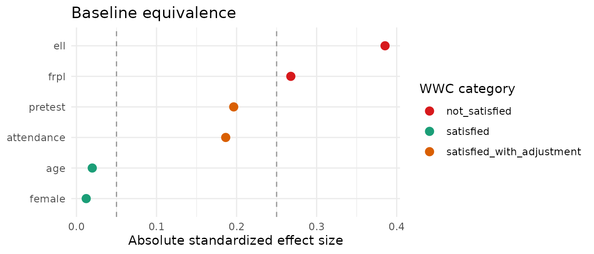

# An impact-evaluation workflow

This vignette walks from a study’s raw data to a baseline-equivalence
report, using the bundled (simulated) `tutoring` dataset.

``` r

library(baselinr)
data(tutoring)
head(tutoring)
#>   treat  pretest attendance  age female frpl ell posttest
#> 1     1 33.02273  0.9416614 10.2      1    0   1     49.8
#> 2     1 47.86310  0.9759478 10.0      1    0   1     53.0
#> 3     1 42.15184  1.0000000 10.3      0    0   0     49.2
#> 4     1 45.37557  0.9483293 10.7      1    0   0     57.4
#> 5     1 38.89146  0.9512494  9.4      0    1   0     49.3
#> 6     1 47.94922  0.9757792  9.4      0    0   1     43.8
```

`tutoring` is a **simulated** quasi-experimental evaluation: 200
students who received a tutoring program (`treat = 1`) and 200 who did
not (`treat = 0`), with baseline covariates and a post-program
`posttest`.

## Step 1: assess baseline equivalence — *before* looking at the outcome

The credibility of any later effect estimate rests on whether the two
groups were comparable at baseline. We pass the **baseline** covariates
explicitly — crucially **not** `posttest`, which is an outcome, not a
baseline covariate.

``` r

baseline_covs <- c("pretest", "attendance", "age", "female", "frpl", "ell")

equiv <- baseline_equivalence(tutoring, treatment = "treat",
                              covariates = baseline_covs)

knitr::kable(equiv, digits = 3)
```

| covariate | type | n_treatment | n_comparison | mean_treatment | mean_comparison | sd_treatment | sd_comparison | effect_size | wwc_category |
|:---|:---|---:|---:|---:|---:|---:|---:|---:|:---|
| pretest | continuous | 200 | 200 | 52.150 | 50.099 | 9.824 | 10.993 | 0.196 | satisfied_with_adjustment |
| attendance | continuous | 200 | 200 | 0.927 | 0.918 | 0.053 | 0.049 | 0.186 | satisfied_with_adjustment |
| age | continuous | 200 | 200 | 10.044 | 10.034 | 0.508 | 0.504 | 0.020 | satisfied |
| female | binary | 200 | 200 | 0.530 | 0.525 | 0.500 | 0.501 | 0.012 | satisfied |
| frpl | binary | 200 | 200 | 0.555 | 0.445 | 0.498 | 0.498 | 0.268 | not_satisfied |
| ell | binary | 200 | 200 | 0.250 | 0.150 | 0.434 | 0.358 | 0.385 | not_satisfied |

`baselinr` automatically uses Hedges’ g for the continuous covariates
(`pretest`, `attendance`, `age`) and the Cox index for the binary ones
(`female`, `frpl`, `ell`).

## Step 2: read the categories

Each covariate falls into one of three What Works Clearinghouse
categories:

``` r

equiv[, c("covariate", "effect_size", "wwc_category")]
#>    covariate effect_size              wwc_category
#> 1    pretest  0.19639834 satisfied_with_adjustment
#> 2 attendance  0.18641935 satisfied_with_adjustment
#> 3        age  0.01971405                 satisfied
#> 4     female  0.01215809                 satisfied
#> 5       frpl  0.26775010             not_satisfied
#> 6        ell  0.38544774             not_satisfied
```

- **`satisfied`** — the groups are equivalent on this covariate; nothing
  more to do.
- **`satisfied_with_adjustment`** — equivalence holds *only if* you
  statistically adjust for this covariate in the impact model. This is a
  commitment, not a pass: those covariates **must** appear in the model.
- **`not_satisfied`** — this covariate cannot establish equivalence even
  with adjustment. It’s a threat to the study’s credibility that you
  have to confront, not bury.

## Step 3: visualise

``` r

love_plot(equiv)
```



The dashed lines mark the 0.05 and 0.25 thresholds; points are coloured
by category. The plot makes the at-risk covariates obvious at a glance.

## Step 4: a report-ready table

For a written report or a Quarto/HTML document,
[`gt_baseline()`](https://zl1212-ship-it.github.io/baselinr/reference/gt_baseline.md)
returns a formatted `gt` table:

``` r

gt_baseline(equiv)
```

## What this does and doesn’t tell you

`baselinr` reports the baseline equivalence picture. It does **not** fit
the impact model for you. The next steps are yours: include the
`satisfied_with_adjustment` covariates in the model, and decide how to
handle (or report the limitation of) any `not_satisfied` covariate
before you interpret the program’s effect on `posttest`.
